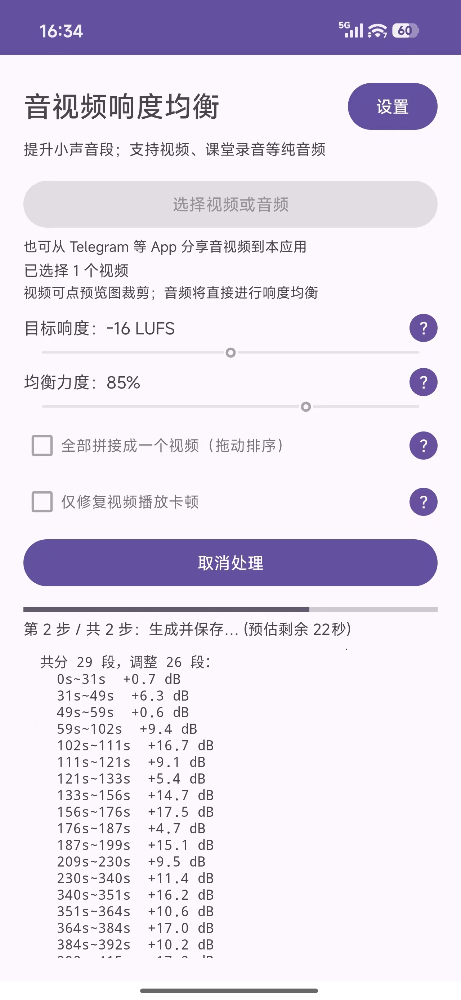
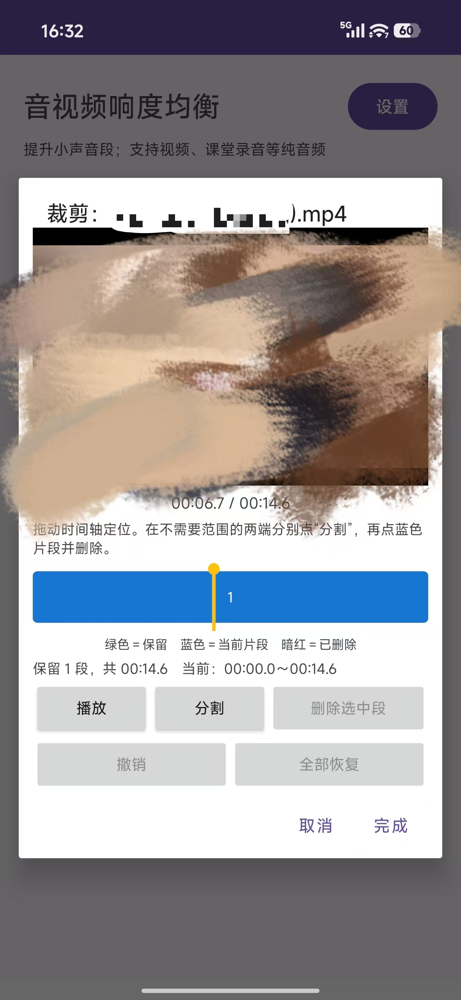

# 响度均衡

一款在 Android 手机上本地处理视频和录音响度的工具。它会分析不同时间段的听感响度，重点提升偏小的声音，同时尽量保留自然起伏。

## 功能

- 支持视频和纯音频批量导入，也可从 Telegram 等应用直接分享文件
- 按时间段进行响度均衡，可调整目标响度和均衡力度
- 未裁剪的视频直接复制画面流，不重新编码画面
- 视频支持预览、分割、删除片段、排序和拼接
- 纯音频输出为 M4A，并尽量沿用原音轨码率，避免低码率录音体积膨胀
- 支持后台处理、进度通知、取消及未完成文件清理
- 可选择自定义保存文件夹

## 界面截图

### 音视频响度处理



### 视频裁剪



## 保存位置

- 视频默认保存到 `Movies/响度均衡`
- 音频默认保存到 `Music/响度均衡`
- 可在设置中选择自定义文件夹
- Android 11 及以上可选择隐藏保存到 `Movies/.响度均衡`

## Android 构建

需要 JDK 17、Android SDK 34 和 Gradle 8.9。在 `android` 目录运行：

```powershell
gradle assembleDebug --no-daemon
```

调试 APK 位于：

```text
android/app/build/outputs/apk/debug/app-debug.apk
```

## 桌面版

仓库同时保留 Python 桌面脚本，可在仓库根目录运行：

```powershell
python 响度均衡.py sample.mp4
```

更多操作见 [安卓使用说明.txt](安卓使用说明.txt) 和 [使用说明.txt](使用说明.txt)。
